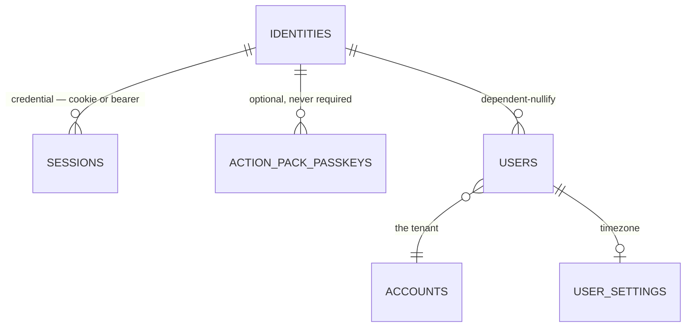
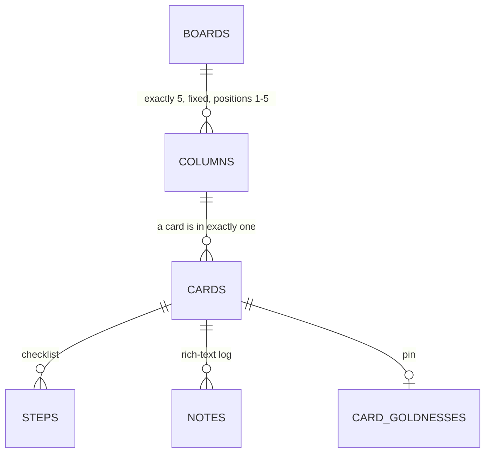
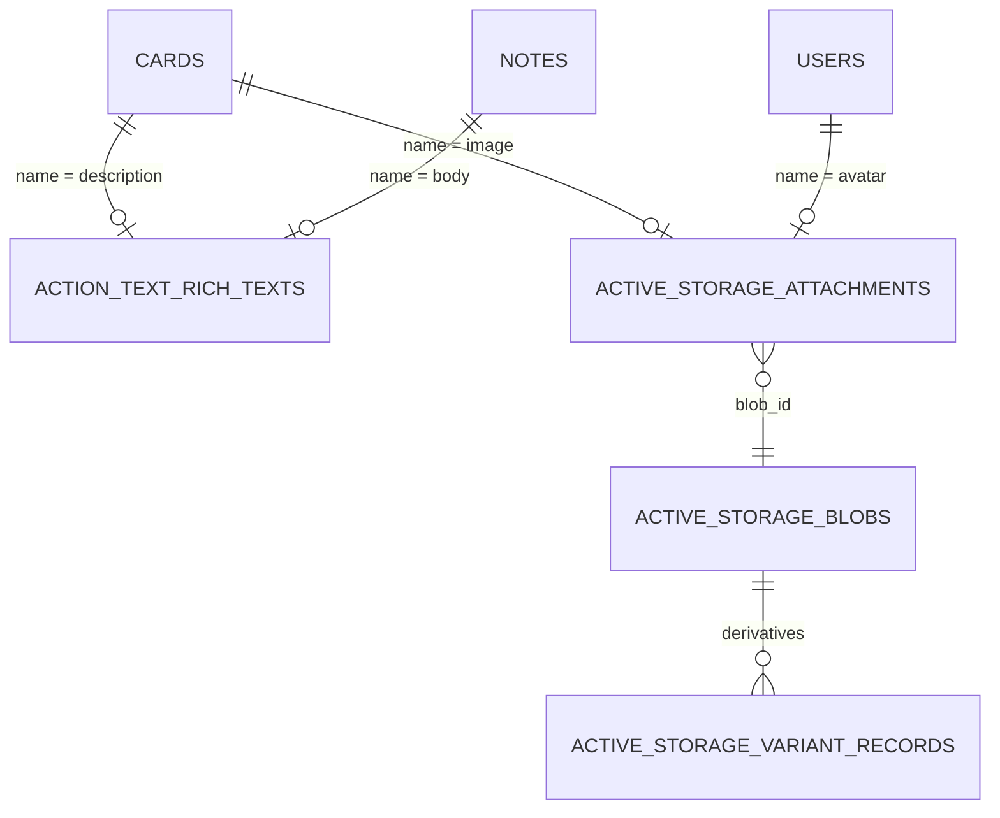
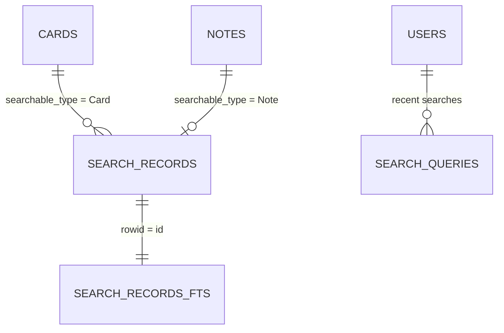

# Mudda — Entity Relationship Diagram

Generated from `db/schema_sqlite.rb` (version `2026_07_05_000000`) and the association
declarations in `app/models/`, then **cross-verified against the live production database**
(snapshot 2026-08-27): all 25 tables, every column name, all 50 indexes and their uniqueness
flags, and the nullability/defaults called out below match. Regenerate after any migration.

> **There are no database-level foreign keys.** `pragma foreign_key_list(<table>)` returns
> nothing for every table in this schema. Every relationship drawn below is enforced by
> Active Record alone — the `REFERENCES` clauses do not exist on disk. Nothing at the
> storage layer prevents an orphaned `column_id`, which is why `Cards::ColumnsController`
> checks board membership itself.

> **Every `uuid` column is a 25-character base36 string in Ruby, stored as a 16-byte
> `blob` in SQLite** (`lib/rails_ext/active_record_uuid_type.rb`: UUIDv7 → hex → base36,
> left-padded; `36^25 > 2^128`). In raw SQL, wrap them in `hex()` to make them printable —
> but that hex is a *different encoding of the same value*, not the id the app or the API
> uses. Read those from the Rails console.

Two columns are deliberately **not** UUIDs: `accounts.external_account_id` and `cards.number`
are separate integer sequences.

---

## Complete diagram

```mermaid
erDiagram
    ACCOUNTS ||--o{ USERS : "has_many dependent-destroy"
    ACCOUNTS ||--o{ BOARDS : "has_many dependent-destroy"
    ACCOUNTS ||--o{ CARDS : "has_many dependent-destroy"
    ACCOUNTS ||--o{ COLUMNS : "has_many dependent-destroy"
    ACCOUNTS ||--o{ SEARCH_QUERIES : "has_many dependent-delete-all"
    ACCOUNTS ||--o{ NOTES : "denormalized account_id"
    ACCOUNTS ||--o{ STEPS : "denormalized account_id"
    ACCOUNTS ||--o{ EVENTS : "denormalized account_id"
    ACCOUNTS ||--o{ FILTERS : "denormalized account_id"
    ACCOUNTS ||--o{ CARD_GOLDNESSES : "denormalized account_id"
    ACCOUNTS ||--o{ USER_SETTINGS : "denormalized account_id"
    ACCOUNTS ||--o{ SEARCH_RECORDS : "denormalized account_id"
    ACCOUNTS ||--o{ ACTION_TEXT_RICH_TEXTS : "denormalized account_id"
    ACCOUNTS ||--o{ ACTIVE_STORAGE_BLOBS : "denormalized account_id"
    ACCOUNTS ||--o{ ACTIVE_STORAGE_ATTACHMENTS : "denormalized account_id"
    ACCOUNTS ||--o{ ACTIVE_STORAGE_VARIANT_RECORDS : "denormalized account_id"

    IDENTITIES ||--o{ SESSIONS : "has_many dependent-destroy"
    IDENTITIES ||--o{ USERS : "has_many dependent-nullify"
    IDENTITIES ||--o{ ACTION_PACK_PASSKEYS : "has_passkeys polymorphic-holder"
    IDENTITIES }o--o{ ACCOUNTS : "has_many through-users"

    USERS ||--o| USER_SETTINGS : "has_one dependent-destroy"
    USERS ||--o{ SEARCH_QUERIES : "has_many dependent-destroy"
    USERS ||--o{ BOARDS : "creator_id"
    USERS ||--o{ CARDS : "creator_id"
    USERS ||--o{ NOTES : "creator_id dependent-destroy"
    USERS ||--o{ FILTERS : "creator_id dependent-destroy"
    USERS ||--o{ EVENTS : "creator_id"

    BOARDS ||--o{ COLUMNS : "has_many dependent-destroy — always 5"
    BOARDS ||--o{ CARDS : "has_many dependent-destroy"
    BOARDS ||--o{ EVENTS : "has_many"
    BOARDS }o--o{ FILTERS : "boards_filters HABTM"

    COLUMNS ||--o{ CARDS : "has_many dependent-destroy — the lifecycle"

    CARDS ||--o{ NOTES : "has_many dependent-destroy"
    CARDS ||--o{ STEPS : "has_many dependent-destroy"
    CARDS ||--o| CARD_GOLDNESSES : "has_one dependent-destroy"
    CARDS ||--o{ SEARCH_RECORDS : "card_id"
    CARDS ||--o| ACTION_TEXT_RICH_TEXTS : "has_rich_text description"
    CARDS ||--o| ACTIVE_STORAGE_ATTACHMENTS : "has_one_attached image"
    CARDS ||--o{ EVENTS : "polymorphic eventable"

    NOTES ||--o| ACTION_TEXT_RICH_TEXTS : "has_rich_text body"
    NOTES ||--o{ EVENTS : "polymorphic eventable"
    NOTES ||--o| SEARCH_RECORDS : "polymorphic searchable"

    ACTIVE_STORAGE_BLOBS ||--o{ ACTIVE_STORAGE_ATTACHMENTS : "blob_id"
    ACTIVE_STORAGE_BLOBS ||--o{ ACTIVE_STORAGE_VARIANT_RECORDS : "blob_id"
    SEARCH_RECORDS ||--|| SEARCH_RECORDS_FTS : "rowid = id"

    ACCOUNTS {
        uuid id PK "base36-25 blob(16)"
        bigint external_account_id UK "integer sequence — NOT a uuid"
        string name "limit 255 NOT NULL"
        bigint cards_count "default 0 — source of Card#number"
        datetime created_at "NOT NULL"
        datetime updated_at "NOT NULL"
    }

    ACCOUNT_EXTERNAL_ID_SEQUENCES {
        uuid id PK
        bigint value UK "default 0 — single-row counter"
    }

    IDENTITIES {
        uuid id PK
        string email_address UK "limit 255 NOT NULL — the global principal"
        datetime created_at "NOT NULL"
        datetime updated_at "NOT NULL"
    }

    SESSIONS {
        uuid id PK
        uuid identity_id FK "NOT NULL indexed"
        string label "limit 255 NULLABLE — NULL means browser cookie session"
        string ip_address "limit 255"
        string user_agent "limit 4096"
        datetime created_at "NOT NULL — no expiry column exists"
        datetime updated_at "NOT NULL"
    }

    ACTION_PACK_PASSKEYS {
        uuid id PK
        uuid holder_id FK "NOT NULL — always an Identity"
        string holder_type "limit 255 NOT NULL"
        string credential_id UK "limit 255 NOT NULL"
        binary public_key "NOT NULL"
        integer sign_count "default 0 NOT NULL"
        string aaguid "limit 255"
        boolean backed_up "nullable"
        string name "limit 255"
        text transports "limit 65535"
        datetime created_at "NOT NULL"
        datetime updated_at "NOT NULL"
    }

    USERS {
        uuid id PK
        uuid account_id FK "NOT NULL"
        uuid identity_id FK "NULLABLE — deactivate nulls it"
        string name "limit 255 NOT NULL"
        boolean active "default true NOT NULL"
        datetime verified_at "nullable"
        datetime created_at "NOT NULL"
        datetime updated_at "NOT NULL"
    }

    USER_SETTINGS {
        uuid id PK
        uuid user_id FK "NOT NULL"
        uuid account_id FK "NOT NULL"
        string timezone_name "limit 255 nullable"
        datetime created_at "NOT NULL"
        datetime updated_at "NOT NULL"
    }

    BOARDS {
        uuid id PK
        uuid account_id FK "NOT NULL"
        uuid creator_id FK "NOT NULL — User"
        string name "limit 255 NOT NULL"
        datetime created_at "NOT NULL"
        datetime updated_at "NOT NULL"
    }

    COLUMNS {
        uuid id PK
        uuid board_id FK "NOT NULL"
        uuid account_id FK "NOT NULL"
        string name "limit 255 NOT NULL — Triage Backlog Todo Doing Done"
        integer position "default 0 NOT NULL — 1..5"
        string color "limit 255 NOT NULL — the only editable field"
        datetime created_at "NOT NULL"
        datetime updated_at "NOT NULL"
    }

    CARDS {
        uuid id PK
        uuid account_id FK "NOT NULL"
        uuid board_id FK "NOT NULL"
        uuid column_id FK "NOT NULL — single source of lifecycle truth"
        uuid creator_id FK "NOT NULL — User"
        bigint number "NOT NULL — per-account integer the API addresses"
        string title "limit 255 NULLABLE"
        string status "limit 255 default drafted NOT NULL — drafted or published"
        date due_on "NULLABLE in DB — required when published"
        datetime last_active_at "NOT NULL"
        datetime created_at "NOT NULL"
        datetime updated_at "NOT NULL"
    }

    CARD_GOLDNESSES {
        uuid id PK
        uuid card_id FK "UNIQUE — enforces has_one pin"
        uuid account_id FK "NOT NULL"
        datetime created_at "NOT NULL"
        datetime updated_at "NOT NULL"
    }

    STEPS {
        uuid id PK
        uuid card_id FK "NOT NULL"
        uuid account_id FK "NOT NULL"
        text content "limit 65535 NOT NULL"
        boolean completed "default false NOT NULL"
        datetime created_at "NOT NULL — no position column: unorderable"
        datetime updated_at "NOT NULL"
    }

    NOTES {
        uuid id PK
        uuid card_id FK "NOT NULL"
        uuid account_id FK "NOT NULL"
        uuid creator_id FK "NOT NULL — only creator may edit"
        datetime created_at "NOT NULL"
        datetime updated_at "NOT NULL"
    }

    EVENTS {
        uuid id PK
        uuid account_id FK "NOT NULL"
        uuid board_id FK "NOT NULL"
        uuid creator_id FK "NOT NULL — User"
        uuid eventable_id FK "NOT NULL"
        string eventable_type "limit 255 NOT NULL — Card or Note"
        string action "limit 255 NOT NULL"
        json particulars "default json_object()"
        datetime created_at "NOT NULL"
        datetime updated_at "NOT NULL"
    }

    FILTERS {
        uuid id PK
        uuid account_id FK "NOT NULL"
        uuid creator_id FK "NOT NULL — User"
        json fields "default json_object() NOT NULL"
        string params_digest "limit 255 NOT NULL — unique per creator"
        datetime created_at "NOT NULL"
        datetime updated_at "NOT NULL"
    }

    BOARDS_FILTERS {
        uuid board_id FK "NOT NULL — HABTM join, no id column"
        uuid filter_id FK "NOT NULL"
    }

    SEARCH_QUERIES {
        uuid id PK
        uuid user_id FK "NOT NULL"
        uuid account_id FK "NOT NULL"
        string terms "limit 2000 NOT NULL"
        datetime created_at "NOT NULL"
        datetime updated_at "NOT NULL"
    }

    SEARCH_RECORDS {
        integer id PK "INTEGER rowid — the only non-uuid PK in the schema"
        uuid account_id FK "NOT NULL"
        uuid board_id FK "NOT NULL"
        uuid card_id FK "NOT NULL — always resolves to a Card"
        uuid searchable_id FK "NOT NULL"
        string searchable_type "limit 255 NOT NULL — Card or Note"
        string title "limit 255 nullable"
        text content "limit 65535 nullable"
        datetime created_at "NOT NULL"
    }

    SEARCH_RECORDS_FTS {
        integer rowid PK "= search_records.id"
        text title "fts5 indexed"
        text content "fts5 indexed"
    }

    ACTION_TEXT_RICH_TEXTS {
        uuid id PK
        uuid record_id FK "NOT NULL"
        string record_type "limit 255 NOT NULL — Card or Note"
        string name "limit 255 NOT NULL — description or body"
        uuid account_id FK "NOT NULL"
        text body "limit 4294967295 — the actual card text lives HERE"
        datetime created_at "NOT NULL"
        datetime updated_at "NOT NULL"
    }

    ACTIVE_STORAGE_ATTACHMENTS {
        uuid id PK
        uuid record_id FK "NOT NULL"
        string record_type "limit 255 NOT NULL — Card or User or Identity"
        string name "limit 255 NOT NULL — image or avatar"
        uuid blob_id FK "NOT NULL"
        uuid account_id FK "NOT NULL"
        datetime created_at "NOT NULL"
    }

    ACTIVE_STORAGE_BLOBS {
        uuid id PK
        string key UK "limit 255 NOT NULL"
        string filename "limit 255 NOT NULL"
        string content_type "limit 255"
        text metadata "limit 65535"
        string service_name "limit 255 NOT NULL — local disk only"
        bigint byte_size "NOT NULL"
        string checksum "limit 255"
        uuid account_id FK "NOT NULL"
        datetime created_at "NOT NULL"
    }

    ACTIVE_STORAGE_VARIANT_RECORDS {
        uuid id PK
        uuid blob_id FK "NOT NULL"
        string variation_digest "limit 255 NOT NULL"
        uuid account_id FK "NOT NULL"
    }

    SCHEMA_MIGRATIONS {
        string version PK "limit 255 — one row per applied migration"
    }

    AR_INTERNAL_METADATA {
        string key PK "limit 255 — environment and schema_sha1"
        string value "limit 255"
        datetime created_at "NOT NULL"
        datetime updated_at "NOT NULL"
    }
```



---

## Focused views

### Authentication chain

`Current` (`app/models/current.rb`) resolves **session → identity → active user → account**.
An identity with no active user yields no account, and every account-scoped request 403s.



There is **no password column anywhere** — the owner secret lives only in
`ENV["MUDDA_OWNER_PASSWORD"]` and is compared by `OwnerPassword` with `secure_compare`.
`sessions.label` distinguishes an API token (`make token LABEL=…`, or `json-sign-in`) from a
browser session (`NULL`); it is the unit of revocation.

### Card lifecycle

`column_id` is the single source of truth — there are no closed/postponed/triage state tables.



| Position | Column | Predicate derived in `Card::Triageable` |
|---|---|---|
| 1 | Triage | `awaiting_triage?` — default for new cards |
| 2 | Backlog | `postponed?` |
| 3 | Todo | triaged, queued |
| 4 | Doing | in progress |
| 5 | Done | `closed?` |

`active?` = published and in neither Done nor Backlog. `open?` = not Done.

### Text and attachments

Card and note **bodies are not in their own tables** — this trips up every raw-SQL query:



```sql
select c.number, c.title, rt.body
from cards c
left join action_text_rich_texts rt
  on rt.record_id = c.id and rt.record_type = 'Card' and rt.name = 'description';
```

### Search



`search_records` denormalizes both cards and notes into one table; **every row carries
`card_id`**, so a note match still resolves to the card that owns it. `search_records_fts`
is an FTS5 virtual table (`tokenize='porter'`) joined by rowid, with the usual FTS5 shadow
tables (`_config`, `_content`, `_data`, `_docsize`, `_idx`) that you should ignore.

---

## Index reference

| Table | Index | Columns | Unique |
|---|---|---|:---:|
| `accounts` | `index_accounts_on_external_account_id` | `external_account_id` | ✓ |
| `account_external_id_sequences` | `..._on_value` | `value` | ✓ |
| `identities` | `index_identities_on_email_address` | `email_address` | ✓ |
| `sessions` | `index_sessions_on_identity_id` | `identity_id` | |
| `action_pack_passkeys` | `..._on_credential_id` | `credential_id` | ✓ |
| `action_pack_passkeys` | `..._on_holder_type_and_holder_id` | `holder_type, holder_id` | |
| `users` | `index_users_on_account_id_and_identity_id` | `account_id, identity_id` | ✓ |
| `users` | `index_users_on_identity_id` | `identity_id` | |
| `user_settings` | `..._on_user_id` / `..._on_account_id` | `user_id` / `account_id` | |
| `boards` | `..._on_account_id` / `..._on_creator_id` | `account_id` / `creator_id` | |
| `columns` | `index_columns_on_board_id_and_position` | `board_id, position` | |
| `columns` | `..._on_board_id` / `..._on_account_id` | `board_id` / `account_id` | |
| `cards` | `index_cards_on_account_id_and_number` | `account_id, number` | ✓ |
| `cards` | `..._on_account_id_and_last_active_at_and_status` | `account_id, last_active_at, status` | |
| `cards` | `..._on_board_id` / `..._on_column_id` | `board_id` / `column_id` | |
| `card_goldnesses` | `index_card_goldnesses_on_card_id` | `card_id` | ✓ |
| `card_goldnesses` | `..._on_account_id` | `account_id` | |
| `steps` | `index_steps_on_card_id_and_completed` | `card_id, completed` | |
| `steps` | `..._on_card_id` / `..._on_account_id` | `card_id` / `account_id` | |
| `notes` | `..._on_card_id` / `..._on_account_id` | `card_id` / `account_id` | |
| `events` | `index_events_on_board_id_and_action_and_created_at` | `board_id, action, created_at` | |
| `events` | `index_events_on_eventable` | `eventable_type, eventable_id` | |
| `events` | `..._on_account_id_and_action` | `account_id, action` | |
| `events` | `..._on_board_id` / `..._on_creator_id` | `board_id` / `creator_id` | |
| `filters` | `index_filters_on_creator_id_and_params_digest` | `creator_id, params_digest` | ✓ |
| `filters` | `..._on_account_id` | `account_id` | |
| `boards_filters` | `..._on_board_id` / `..._on_filter_id` | `board_id` / `filter_id` | |
| `search_queries` | `..._on_user_id_and_updated_at` | `user_id, updated_at` | ✓ |
| `search_queries` | `..._on_user_id_and_terms` | `user_id, terms` | |
| `search_queries` | `..._on_user_id` / `..._on_account_id` | `user_id` / `account_id` | |
| `search_records` | `..._on_searchable_type_and_searchable_id` | `searchable_type, searchable_id` | ✓ |
| `search_records` | `..._on_account_id` | `account_id` | |
| `action_text_rich_texts` | `index_action_text_rich_texts_uniqueness` | `record_type, record_id, name` | ✓ |
| `action_text_rich_texts` | `..._on_account_id` | `account_id` | |
| `active_storage_blobs` | `..._on_key` | `key` | ✓ |
| `active_storage_blobs` | `..._on_account_id` | `account_id` | |
| `active_storage_attachments` | `..._uniqueness` | `record_type, record_id, name, blob_id` | ✓ |
| `active_storage_attachments` | `..._on_blob_id` | `blob_id` | |
| `active_storage_attachments` | `..._on_account_id` | `account_id` | |
| `active_storage_variant_records` | `..._uniqueness` | `blob_id, variation_digest` | ✓ |
| `active_storage_variant_records` | `..._on_account_id` | `account_id` | |

---

## Enumerated values

**`cards.status`** — `drafted` (default) · `published`. A card is published via `Card#publish`,
which also requires `due_on`.

**`columns.name`** — `Triage` · `Backlog` · `Todo` · `Doing` · `Done`. Created together by
`Board::Triageable` on every board; not creatable, reorderable, or deletable.

**`events.action`** — written by `Eventable#track_event` as `<type>_<action>`:

| Action | Eventable | `particulars` | Written by |
|---|---|---|---|
| `card_published` | Card | `{}` | `Card::Statuses` (on create if published, and on `publish`) |
| `card_triaged` | Card | `{column}` | `Card::Triageable#triage_into` |
| `card_title_changed` | Card | `{old_title, new_title}` | `Card::Eventable` |
| `card_board_changed` | Card | `{old_board, new_board}` | `Card#move_to` |
| `note_created` | Note | `{}` | `Note::Eventable` |

**`action_text_rich_texts.name`** — `description` (on Card) · `body` (on Note).
**`active_storage_attachments.name`** — `image` (on Card) · `avatar` (on User / Identity).
**`sessions.label`** — `NULL` (browser) · `json-sign-in` · any label from `make token LABEL=…`.

---

## Notes on vestigial and infrastructure tables

- **`account_external_id_sequences`** is empty in production and never consulted.
  `Account#assign_external_account_id` uses `||=`, and `db/seeds.rb` supplies the value
  directly via `ActiveRecord::FixtureSet.identify(account_name)` — a deterministic hash of
  the account name. Its one live consumer is the `localStorage` key for the last-opened board
  (`ApplicationHelper#last_board_storage_key`). Multi-tenant scaffolding that survived the fork trim.
- **`schema_migrations`** and **`ar_internal_metadata`** are Rails-owned and do not appear in
  `db/schema_sqlite.rb` — Rails creates them in every database. `schema_migrations` holds one
  `version` row per applied migration; `db:migrate` compares it against `db/migrate/`.
- **`ar_internal_metadata`** is Rails' own. `environment` is what makes `db:drop`/`db:reset`
  refuse to run against production. Never edit it.
- **`account_id` is denormalized onto nearly every table**, including the Action Text and
  Active Storage tables, as a holdover from the multi-tenant original. In a single-account
  build it is uniformly one value.
- **`boards_filters`** is a classic HABTM join with `id: false` — no primary key, two indexes.

## Regenerating

```bash
# schema (after a migration)
docker compose exec web bin/rails db:migrate     # rewrites db/schema_sqlite.rb

# verify a table against the live DB
docker compose exec -T web sqlite3 storage/development.sqlite3 ".schema --indent cards"
```
