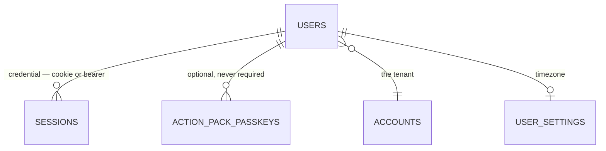
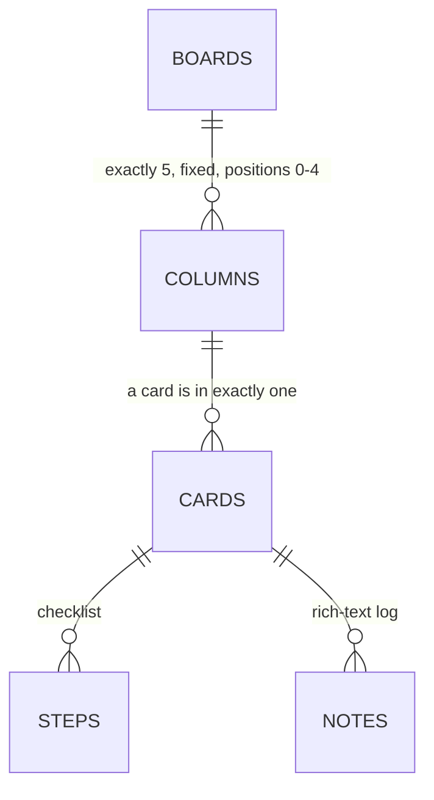
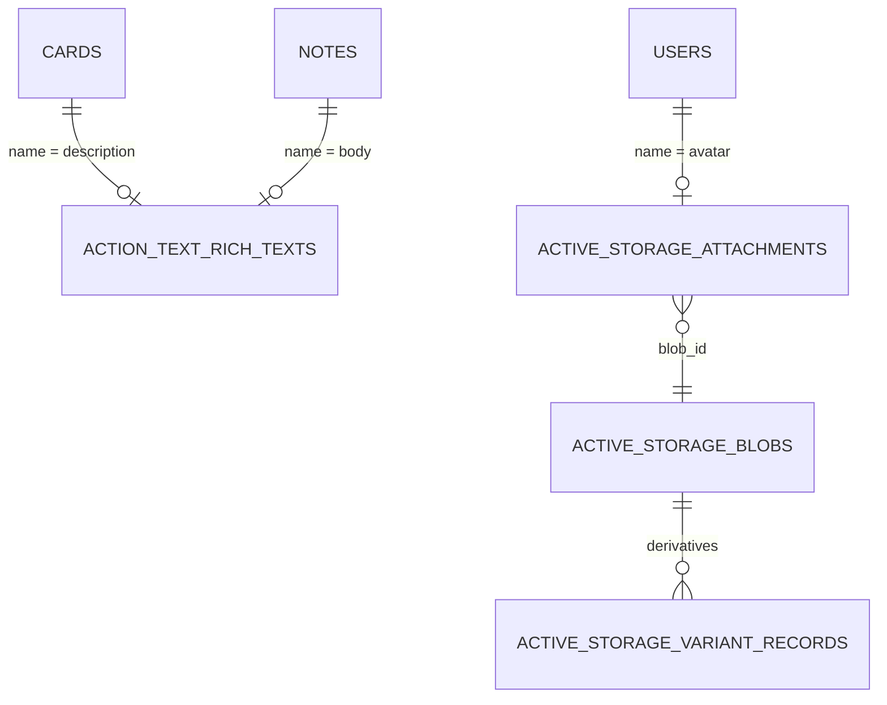
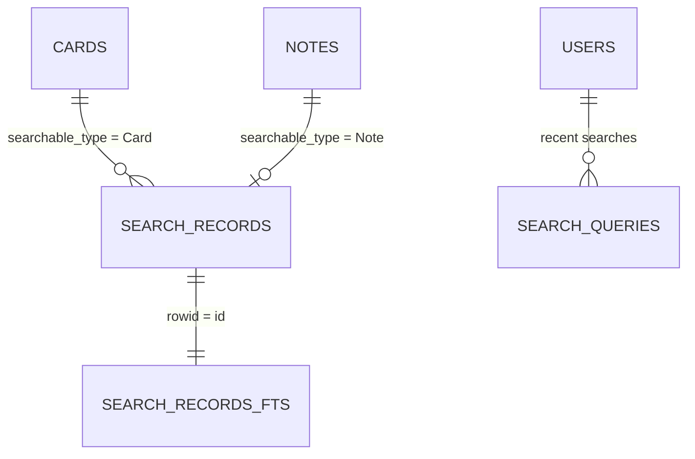

# Mudda — Entity Relationship Diagram

Generated from `db/schema_sqlite.rb` (version `2026_08_28_000000`) and the association
declarations in `app/models/`, then verified against a live database: all tables, every
column name, and all 31 indexes with their uniqueness flags match. Regenerate after any
migration.

> **There are no database-level foreign keys.** `pragma foreign_key_list(<table>)` returns
> nothing for every table in this schema. Every relationship drawn below is enforced by
> Active Record alone — the `REFERENCES` clauses do not exist on disk. Nothing at the
> storage layer prevents an orphaned `column_id`, which is why `Cards::ColumnsController`
> checks board membership itself.

Every key is a plain autoincrementing integer. `SELECT` in a SQL client prints the same ids
the app and the API use, and `sqlite_sequence` holds the counters.

`cards.number` is a **separate** integer, not a key: a per-board sequence drawn from
`boards.cards_count`, and the number the URLs and the API address a card by. It is unique
only within its board.

---

## Complete diagram

```mermaid
erDiagram
    ACCOUNTS ||--o{ USERS : "has_many dependent-destroy"
    ACCOUNTS ||--o{ BOARDS : "has_many dependent-destroy"

    USERS ||--o{ SESSIONS : "has_many dependent-destroy — browser or token"
    USERS ||--o{ ACTION_PACK_PASSKEYS : "has_passkeys polymorphic-holder"
    USERS ||--o| USER_SETTINGS : "has_one dependent-destroy"
    USERS ||--o{ SEARCH_QUERIES : "has_many dependent-destroy"
    USERS ||--o{ BOARDS : "creator_id"
    USERS ||--o{ CARDS : "creator_id"
    USERS ||--o{ NOTES : "creator_id dependent-destroy"
    USERS ||--o{ FILTERS : "creator_id dependent-destroy"
    USERS ||--o{ EVENTS : "creator_id"

    BOARDS ||--o{ COLUMNS : "has_many dependent-destroy — always 5"
    BOARDS ||--o{ CARDS : "has_many dependent-destroy"
    BOARDS ||--o{ EVENTS : "has_many"
    BOARDS ||--o{ SEARCH_RECORDS : "board_id"
    BOARDS }o--o{ FILTERS : "boards_filters HABTM"

    COLUMNS ||--o{ CARDS : "has_many dependent-destroy — the lifecycle"

    CARDS ||--o{ NOTES : "has_many dependent-destroy"
    CARDS ||--o{ STEPS : "has_many dependent-destroy"
    CARDS ||--o{ SEARCH_RECORDS : "card_id"
    CARDS ||--o| ACTION_TEXT_RICH_TEXTS : "has_rich_text description"
    CARDS ||--o{ EVENTS : "polymorphic eventable"

    NOTES ||--o| ACTION_TEXT_RICH_TEXTS : "has_rich_text body"
    NOTES ||--o{ EVENTS : "polymorphic eventable"
    NOTES ||--o| SEARCH_RECORDS : "polymorphic searchable"

    ACTIVE_STORAGE_BLOBS ||--o{ ACTIVE_STORAGE_ATTACHMENTS : "blob_id"
    ACTIVE_STORAGE_BLOBS ||--o{ ACTIVE_STORAGE_VARIANT_RECORDS : "blob_id"
    SEARCH_RECORDS ||--|| SEARCH_RECORDS_FTS : "rowid = id"

    ACCOUNTS {
        bigint id PK
        string name "limit 255 NOT NULL"
        datetime created_at "NOT NULL"
        datetime updated_at "NOT NULL"
    }

    USERS {
        bigint id PK
        bigint account_id FK "NOT NULL"
        string email_address UK "limit 255 NOT NULL — the principal"
        string name "limit 255 NOT NULL"
        boolean active "default true NOT NULL"
        datetime verified_at "nullable"
        datetime created_at "NOT NULL"
        datetime updated_at "NOT NULL"
    }

    USER_SETTINGS {
        bigint id PK
        bigint user_id FK "UNIQUE — enforces has_one"
        string timezone_name "limit 255 nullable"
        datetime created_at "NOT NULL"
        datetime updated_at "NOT NULL"
    }

    SESSIONS {
        bigint id PK
        bigint user_id FK "NOT NULL"
        string kind "limit 255 default browser NOT NULL — browser or token"
        string label "limit 255 — present iff kind is token"
        string ip_address "limit 255"
        string user_agent "limit 4096"
        datetime created_at "NOT NULL — no expiry column; it is signed into the token"
        datetime updated_at "NOT NULL"
    }

    ACTION_PACK_PASSKEYS {
        bigint id PK
        bigint holder_id FK "NOT NULL — always a User"
        string holder_type "limit 255 NOT NULL"
        string credential_id UK "limit 255 NOT NULL"
        binary public_key "NOT NULL"
        integer sign_count "default 0 NOT NULL"
        string aaguid "limit 255"
        boolean backed_up "nullable"
        string name "limit 255"
        text transports "limit 65535"
        datetime created_at "NOT NULL"
        datetime updated_at "NOT NULL"
    }

    BOARDS {
        bigint id PK
        bigint account_id FK "NOT NULL"
        bigint creator_id FK "NOT NULL — User"
        string name "limit 255 NOT NULL"
        bigint cards_count "default 0 NOT NULL — source of Card#number"
        datetime created_at "NOT NULL"
        datetime updated_at "NOT NULL"
    }

    COLUMNS {
        bigint id PK
        bigint board_id FK "NOT NULL"
        string name "limit 255 NOT NULL — Triage Backlog Todo Doing Done"
        integer position "default 0 NOT NULL — 0..4"
        string color "limit 255 NOT NULL — the only editable field"
        datetime created_at "NOT NULL"
        datetime updated_at "NOT NULL"
    }

    CARDS {
        bigint id PK
        bigint board_id FK "NOT NULL"
        bigint column_id FK "NOT NULL — single source of lifecycle truth"
        bigint creator_id FK "NOT NULL — User"
        bigint number "NOT NULL — per-board sequence the API addresses"
        string title "limit 255 NULLABLE"
        date due_on "NULLABLE in DB — required by the model"
        boolean golden "default false NOT NULL — the pin"
        datetime last_active_at "NOT NULL"
        datetime created_at "NOT NULL"
        datetime updated_at "NOT NULL"
    }

    STEPS {
        bigint id PK
        bigint card_id FK "NOT NULL"
        text content "limit 65535 NOT NULL"
        boolean completed "default false NOT NULL"
        datetime created_at "NOT NULL — no position column: unorderable"
        datetime updated_at "NOT NULL"
    }

    NOTES {
        bigint id PK
        bigint card_id FK "NOT NULL"
        bigint creator_id FK "NOT NULL — only creator may edit"
        datetime created_at "NOT NULL"
        datetime updated_at "NOT NULL"
    }

    EVENTS {
        bigint id PK
        bigint board_id FK "NOT NULL"
        bigint creator_id FK "NOT NULL — User"
        bigint eventable_id FK "NOT NULL"
        string eventable_type "limit 255 NOT NULL — Card or Note"
        string action "limit 255 NOT NULL"
        json particulars "default json_object()"
        datetime created_at "NOT NULL"
        datetime updated_at "NOT NULL"
    }

    FILTERS {
        bigint id PK
        bigint creator_id FK "NOT NULL — User"
        json fields "default json_object() NOT NULL"
        string params_digest "limit 255 NOT NULL — unique per creator"
        datetime created_at "NOT NULL"
        datetime updated_at "NOT NULL"
    }

    BOARDS_FILTERS {
        bigint board_id FK "NOT NULL — HABTM join, no id column"
        bigint filter_id FK "NOT NULL"
    }

    SEARCH_QUERIES {
        bigint id PK
        bigint user_id FK "NOT NULL"
        string terms "limit 2000 NOT NULL"
        datetime created_at "NOT NULL"
        datetime updated_at "NOT NULL"
    }

    SEARCH_RECORDS {
        bigint id PK "the FTS rowid"
        bigint board_id FK "NOT NULL — what scopes a search to the account"
        bigint card_id FK "NOT NULL — always resolves to a Card"
        bigint searchable_id FK "NOT NULL"
        string searchable_type "limit 255 NOT NULL — Card or Note"
        string title "limit 255 nullable"
        text content "limit 65535 nullable"
        datetime created_at "NOT NULL"
    }

    SEARCH_RECORDS_FTS {
        integer rowid PK "= search_records.id"
        text title "fts5 indexed"
        text content "fts5 indexed"
    }

    ACTION_TEXT_RICH_TEXTS {
        bigint id PK
        bigint record_id FK "NOT NULL"
        string record_type "limit 255 NOT NULL — Card or Note"
        string name "limit 255 NOT NULL — description or body"
        text body "limit 4294967295 — the actual card text lives HERE"
        datetime created_at "NOT NULL"
        datetime updated_at "NOT NULL"
    }

    ACTIVE_STORAGE_ATTACHMENTS {
        bigint id PK
        bigint record_id FK "NOT NULL"
        string record_type "limit 255 NOT NULL — User or ActionText::RichText"
        string name "limit 255 NOT NULL — avatar or embeds"
        bigint blob_id FK "NOT NULL"
        datetime created_at "NOT NULL"
    }

    ACTIVE_STORAGE_BLOBS {
        bigint id PK
        string key UK "limit 255 NOT NULL"
        string filename "limit 255 NOT NULL"
        string content_type "limit 255"
        text metadata "limit 65535"
        string service_name "limit 255 NOT NULL — local disk only"
        bigint byte_size "NOT NULL"
        string checksum "limit 255"
        datetime created_at "NOT NULL"
    }

    ACTIVE_STORAGE_VARIANT_RECORDS {
        bigint id PK
        bigint blob_id FK "NOT NULL"
        string variation_digest "limit 255 NOT NULL"
    }

    SCHEMA_MIGRATIONS {
        string version PK "limit 255 — one row per applied migration"
    }

    AR_INTERNAL_METADATA {
        string key PK "limit 255 — environment and schema_sha1"
        string value "limit 255"
        datetime created_at "NOT NULL"
        datetime updated_at "NOT NULL"
    }
```



---

## Focused views

### Authentication chain

`Current` (`app/models/current.rb`) resolves **session → user → account**. A deactivated user
is still named — `Authorization` is what refuses them — but has no account, so a browser is
signed out and a JSON client gets a 403 rather than a 401.



There is **no password column anywhere** — the owner secret lives only in
`ENV["MUDDA_OWNER_PASSWORD"]` and is compared by `OwnerPassword` with `secure_compare`.
`sessions.kind` says how a user is present: a `browser` cookie, or a `token` minted by
`make token LABEL=…` or the JSON sign-in. A token carries a `label`, and a browser session
never does; the label is the unit of revocation, and one label holds one live token.

### Card lifecycle

`column_id` is the single source of truth — there are no closed/postponed/triage state tables.



| Position | Column | Predicate derived in `Card::Triageable` |
|---|---|---|
| 0 | Triage | `awaiting_triage?` — default for new cards |
| 1 | Backlog | `postponed?` |
| 2 | Todo | triaged, queued |
| 3 | Doing | in progress |
| 4 | Done | `closed?` |

`active?` = in neither Done nor Backlog. `open?` = not Done. `golden?` is the
pin, and it is a column on the card.

### Text and attachments

Card and note **bodies are not in their own tables** — this trips up every raw-SQL query:



```sql
select c.board_id, c.number, c.title, rt.body
from cards c
left join action_text_rich_texts rt
  on rt.record_id = c.id and rt.record_type = 'Card' and rt.name = 'description';
```

### Search



`search_records` denormalizes both cards and notes into one table; **every row carries
`card_id`**, so a note match still resolves to the card that owns it, and `board_id` is what
scopes a query to the searcher's account (`Search::Record.for_query`). `search_records_fts`
is an FTS5 virtual table (`tokenize='porter'`) joined by rowid, with the usual FTS5 shadow
tables (`_config`, `_content`, `_data`, `_docsize`, `_idx`) that you should ignore.

---

## Index reference

| Table | Index | Columns | Unique |
|---|---|---|:---:|
| `users` | `index_users_on_email_address` | `email_address` | ✓ |
| `users` | `index_users_on_account_id` | `account_id` | |
| `user_settings` | `index_user_settings_on_user_id` | `user_id` | ✓ |
| `sessions` | `index_sessions_on_user_id_and_kind` | `user_id, kind` | |
| `action_pack_passkeys` | `..._on_credential_id` | `credential_id` | ✓ |
| `action_pack_passkeys` | `..._on_holder_type_and_holder_id` | `holder_type, holder_id` | |
| `boards` | `..._on_account_id` / `..._on_creator_id` | `account_id` / `creator_id` | |
| `columns` | `index_columns_on_board_id_and_position` | `board_id, position` | |
| `cards` | `index_cards_on_board_id_and_number` | `board_id, number` | ✓ |
| `cards` | `..._on_board_id_and_last_active_at` | `board_id, last_active_at` | |
| `cards` | `..._on_column_id` / `..._on_creator_id` | `column_id` / `creator_id` | |
| `steps` | `index_steps_on_card_id_and_completed` | `card_id, completed` | |
| `notes` | `..._on_card_id` / `..._on_creator_id` | `card_id` / `creator_id` | |
| `events` | `index_events_on_board_id_and_action_and_created_at` | `board_id, action, created_at` | |
| `events` | `index_events_on_eventable` | `eventable_type, eventable_id` | |
| `events` | `..._on_creator_id` | `creator_id` | |
| `filters` | `index_filters_on_creator_id_and_params_digest` | `creator_id, params_digest` | ✓ |
| `boards_filters` | `..._on_board_id` / `..._on_filter_id` | `board_id` / `filter_id` | |
| `search_queries` | `..._on_user_id_and_updated_at` | `user_id, updated_at` | ✓ |
| `search_queries` | `..._on_user_id_and_terms` | `user_id, terms` | |
| `search_records` | `..._on_searchable_type_and_searchable_id` | `searchable_type, searchable_id` | ✓ |
| `search_records` | `..._on_card_id` | `card_id` | |
| `action_text_rich_texts` | `index_action_text_rich_texts_uniqueness` | `record_type, record_id, name` | ✓ |
| `active_storage_blobs` | `..._on_key` | `key` | ✓ |
| `active_storage_attachments` | `..._uniqueness` | `record_type, record_id, name, blob_id` | ✓ |
| `active_storage_attachments` | `..._on_blob_id` | `blob_id` | |
| `active_storage_variant_records` | `..._uniqueness` | `blob_id, variation_digest` | ✓ |

---

## Enumerated values

**`sessions.kind`** — `browser` (default, a cookie) · `token` (an API token, always labelled).

**`columns.name`** — `Triage` · `Backlog` · `Todo` · `Doing` · `Done`. Created together by
`Board::Triageable` on every board; not creatable, reorderable, or deletable.

**`events.action`** — written by `Eventable#track_event` as `<type>_<action>`:

| Action | Eventable | `particulars` | Written by |
|---|---|---|---|
| `card_created` | Card | `{}` | `Card::Eventable` (on create) |
| `card_triaged` | Card | `{column}` | `Card::Triageable` (on any change of `column_id`) |
| `card_title_changed` | Card | `{old_title, new_title}` | `Card::Eventable` |
| `card_board_changed` | Card | `{old_board, new_board}` | `Card#handle_board_change` |
| `note_created` | Note | `{}` | `Note::Eventable` |

**`action_text_rich_texts.name`** — `description` (on Card) · `body` (on Note).
**`active_storage_attachments.name`** — `avatar` (on User) · `embeds` (on ActionText::RichText, for rich text attachments).

---

## Notes on infrastructure tables

- **`schema_migrations`** and **`ar_internal_metadata`** are Rails-owned and do not appear in
  `db/schema_sqlite.rb` — Rails creates them in every database. `schema_migrations` holds one
  `version` row per applied migration; `db:migrate` compares it against `db/migrate/`.
  `ar_internal_metadata`'s `environment` row is what makes `db:drop`/`db:reset` refuse to run
  against production. Never edit it.
- **`sqlite_sequence`** holds the autoincrement high-water mark for every table with an
  integer primary key. SQLite maintains it; nothing in the app reads it.
- **`boards_filters`** is a classic HABTM join with `id: false` — no primary key, two indexes.

## Regenerating

```bash
# schema (after a migration)
docker compose exec web bin/rails db:migrate     # rewrites db/schema_sqlite.rb

# verify a table against the live DB
docker compose exec -T web sqlite3 storage/development.sqlite3 ".schema --indent cards"
```
